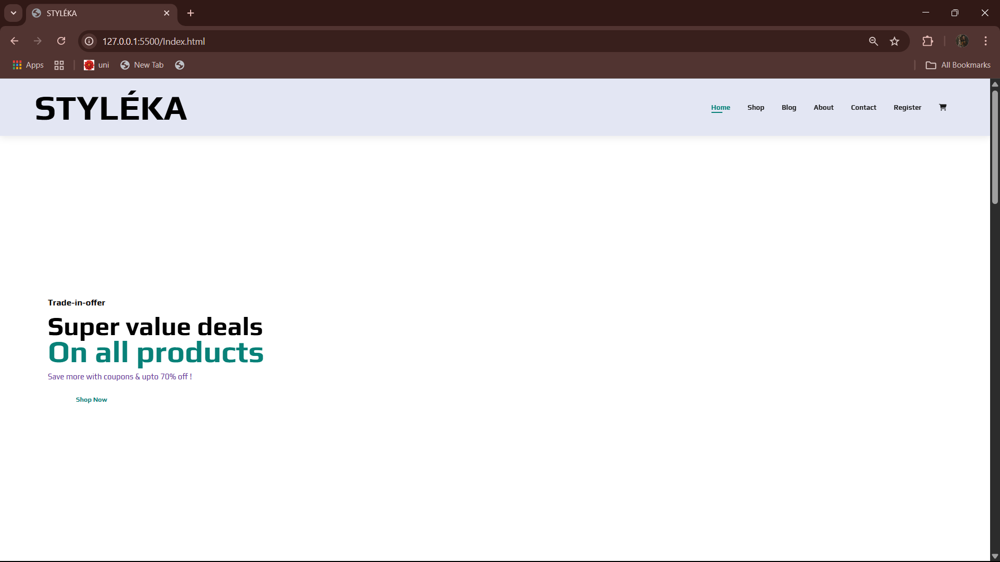
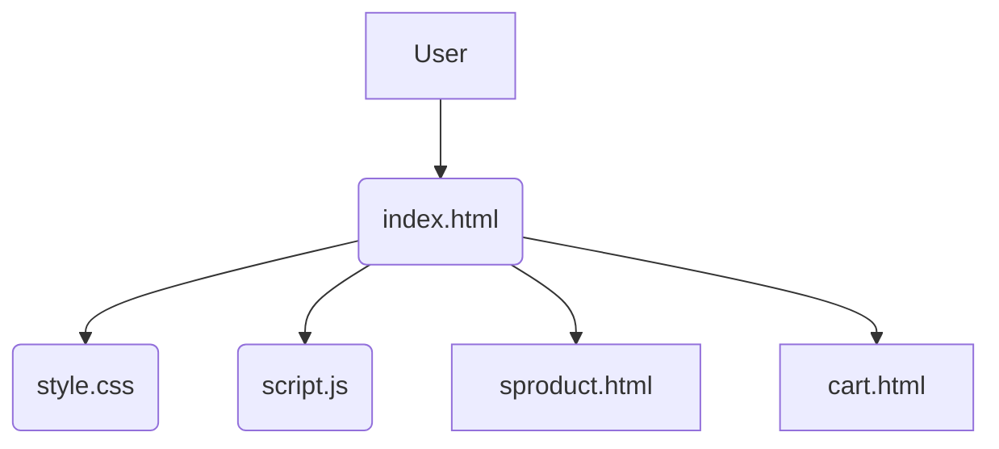
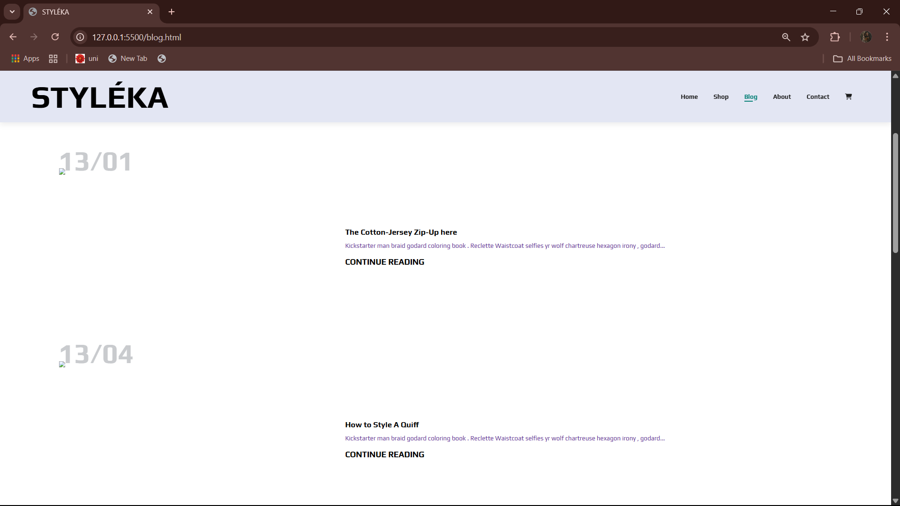
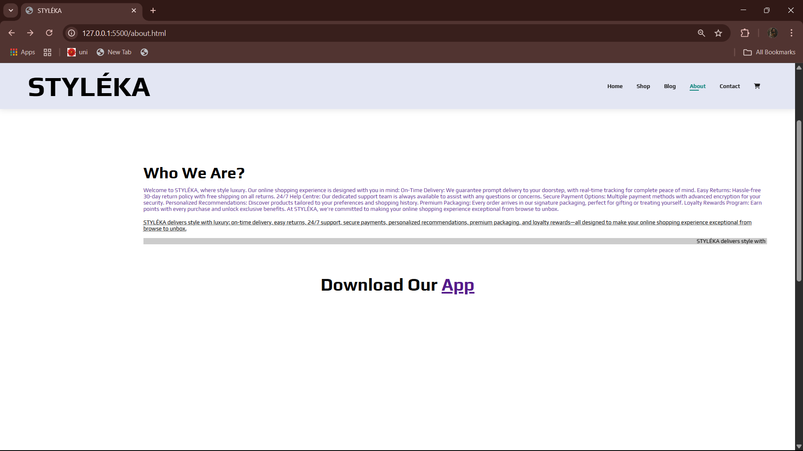
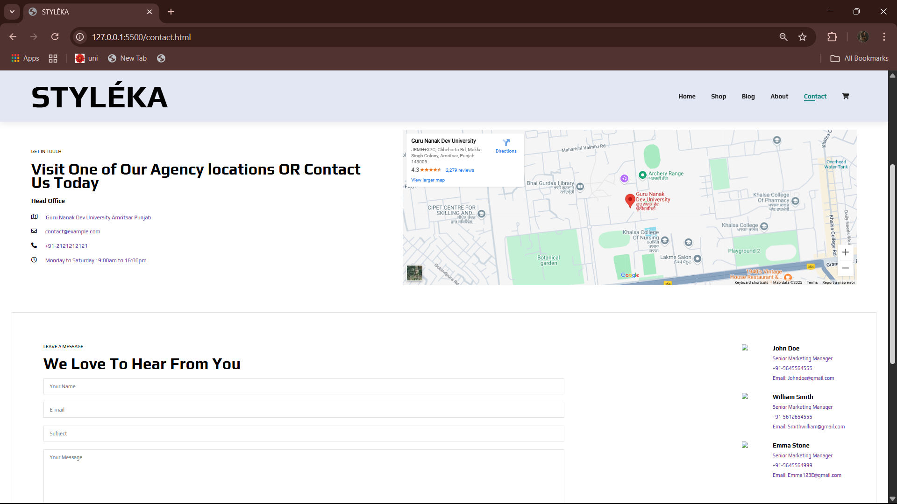
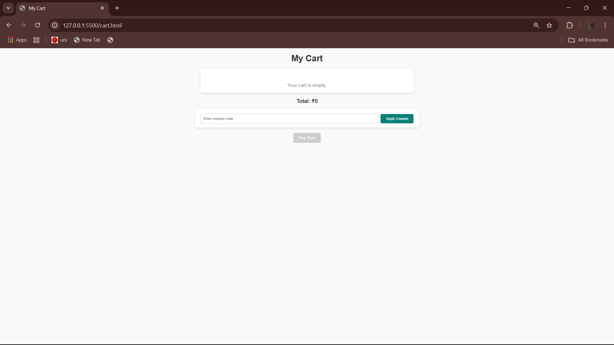

---


<p align="center">
  
  
  
</p>

<h1 align="center">🛍️ STYLÉKA</h1>

<p align="center">  
A **stylish & modern fashion e-commerce platform** — built with clean front-end technologies and ready for future backend integration.  
</p>

<p align="center">
  
</p>

---

## 📚 Table of Contents

* [🎯 Introduction](#-introduction)
* [✨ Features](#-features)
* [📁 Directory Structure](#-directory-structure)
* [🛠 Tech Stack](#-tech-stack)
* [🧠 System Architecture](#-system-architecture)
* [📸 Screenshots](#-screenshots)
* [🚀 Getting Started](#-getting-started)
* [🌐 Community & Support](#-community--support)
* [🤝 Contributing](#-contributing)
* [📄 License](#-license)
* [📝 Reviews & Rating](#-reviews--rating)
* [🌟 Acknowledgment](#-acknowledgment)

---

## 🎯 Introduction

> **STYLÉKA** is a front-end fashion e-commerce website that delivers a seamless and immersive user shopping experience.
> With rich product listings, ratings, blog content, and responsive design, it's your ideal fashion storefront template — made for developers and designers alike.

---

## ✨ Features

* 🛒 **Product Listings** with dynamic ratings, prices, and labels
* 🛍️ **15+ Individual Product Pages** with images and descriptions
* 🧾 **Cart Functionality** (static UI with plans for dynamic integration)
* 📝 **Fashion Blog** to attract and retain customers
* 📬 **Newsletter Subscription** form
* 👥 **Team & About Section** with contact form
* 💬 **Product Reviews UI**
* 📱 **Fully Responsive** across mobile, tablet, and desktop

---

## 📁 Directory Structure

```bash
STYLEKA/
├── Screenshots/            # App UI screenshots
├── sproduct.html → .sproduct15.html  # Individual product pages
├── about.html              # About page
├── blog.html               # Blog section
├── cart.html               # Cart interface
├── contact.html            # Contact form
├── index.html              # Landing/Home page
├── login.html / register.html
├── shop.html               # All products listing
├── script.js               # Core JavaScript
├── style.css               # Styling
├── server.js               # (placeholder for backend)
└── README.md
```

---

## 🛠 Tech Stack

| Tech                         | Usage                           |
| ---------------------------- | ------------------------------- |
| **HTML5**                    | Semantic structure              |
| **CSS3**                     | Modern layout, custom styles    |
| **JavaScript**               | DOM interactivity               |
| *(Future)* Node.js & Express | Backend logic & API integration |

---

## 🧠 System Architecture



🧩 Currently front-end only. Backend endpoints and product databases will be integrated in future milestones.

---

## 📸 Screenshots

| 📍 Page    | Preview                             |
| ---------- | ----------------------------------- |
| 🏠 Home    |        |
| 🛍️ Shop   |        |
| ✍️ Blog    |        |
| 🙋 About   |      |
| 📞 Contact |  |
| 🛒 Cart    |        |

---

## 🚀 Getting Started

🖥️ **Run Locally in 2 Steps** — No installations needed!

```bash
# Windows
start index.html

# macOS
open index.html
```

> 💡 *Tip: Use Live Server in VS Code for better dev experience.*

---

## 🌐 Community & Support

| Platform                                                               | Purpose                       |
| ---------------------------------------------------------------------- | ----------------------------- |
| [GitHub Issues](https://github.com/RAJVEER42/STYLEKA/issues)           | Report bugs, request features |
| [GitHub Discussions](https://github.com/RAJVEER42/STYLEKA/discussions) | Q\&A, tips, suggestions       |
| **Discord**                                                            | Live chat & collaboration     |
| **GSSoC Mentors**                                                      | Guidance & code reviews       |

---

## 🤝 Contributing

We 💖 contributions!
Here’s how to get started:

```bash
# 1. Fork the repository
# 2. Create your branch
git checkout -b feature/your-feature-name

# 3. Make your changes and commit
git commit -m "✨ Added new feature"

# 4. Push and create a PR
git push origin feature/your-feature-name
```

📘 Read [`CONTRIBUTING.md`](./CONTRIBUTING.md) for complete guidelines.

---

## 📄 License

📝 **MIT License** — Free to use, modify, and distribute.

---

## 📝 Reviews & Rating

> ⭐ **User Rating**: 4.9 / 5


We love feedback!

* 💬 Share ideas via [Discussions](https://github.com/RAJVEER42/STYLEKA/discussions)
* 🐞 Report bugs via [Issues](https://github.com/RAJVEER42/STYLEKA/issues)
* ⭐ Star the repo if you enjoy the project!

---

## 🌟 Acknowledgment

> 🧡 Proud Project of **GirlScript Summer of Code (GSSoC)**
> Supporting beginner-friendly contributions and open-source learning for all.

<p align="center">
  
</p>

---

<p align="center">
  Made with 💕 by <a href="https://github.com/SAMBUDAR">SAMBUDAR</a> & contributors
</p>

---


